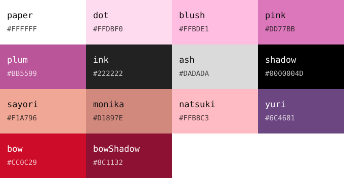

<div align="center">

# DDLC palette

**The Doki Doki Literature Club colours, measured off the official site** （´ω｀♡%）

  [](LICENSE) [](https://github.com/rokokol/ddlc-palette/actions/workflows/check.yml)



[Русский](README.ru.md)

</div>

One source of truth for every DDLC-themed thing I build, so the same pink does not get eyeballed a fifth time. [`palette.json`](palette.json) is that source; everything in [`dist/`](dist) is generated from it and committed, so a consumer without Nix just reads a file

## Where the numbers come from

Not from a screenshot and not from taste — from [ddlc.moe](https://ddlc.moe/) itself:

| | what was read |
| --- | --- |
| **interface** | `main.css` — the divider, the button and its hover, the link colour, the dark footer |
| **dot**, **paper** | `images/tilebg.png`, the site's own background tile: 200×200, dots of radius 40 on a half-step grid, `#FFDBF0` on white |
| **characters** | the `sticker_?.png` sprites: most frequent hair colour across the top of each head, Sayori's and Monika's eyes, and Yuri's hair out of the light |
| **uniform** | the same four sprites: the jacket and the pleated skirt, the palette's only mid grey and its darker blue |
| **notebook** | `images/screen2.png`, the poem minigame: the cover ribbon and the ruled lines — the two tones no sprite holds, a green dark enough for white and the one blue that reads on either ground |
| **accents** | `images/screen5.png`, the two tones of Sayori's bow — the site ships no other strong red |

Nothing here is invented. Where the site paints a flat fill the measurement is its commonest pixel, and every colour above is that — except one. Monika's iris is a ramp: 64 shades over 68 pixels, four of them tied at two pixels each. A tie-break over equally frequent shades is not a measurement, so that is where the rule forks and `monikaEye` is the mean of the bucket instead. `canonize.sh` says on stderr when it forks, so the method can never change quietly

Each entry in `palette.json` carries its own `where`, `source` and `method`, so nothing in here is unattributable and no hex hides how it was arrived at:

| `method` | how the hex was arrived at | how many |
| --- | --- | --- |
| `declared` | lifted straight out of a `main.css` declaration, so there is nothing to measure | 6 |
| `mode` | the commonest pixel of everything the colour's predicate accepts | 13 |
| `mean` | the average of that bucket, because its top count was tied — today only `monikaEye` | 1 |
| `hand` | transcribed rather than read: `shadow` alone, whose `rgba(0, 0, 0, .3)` is no hex to fetch | 1 |

A check refuses a palette entry that is missing any of the four fields or claims a method outside that list, so a colour added later cannot arrive unattributed

## Use it

**Nix.** The flake exposes the palette as plain data — no module, no options, nothing to enable:

```nix
{
  inputs.ddlc-palette.url = "github:rokokol/ddlc-palette";

  # inputs.ddlc-palette.lib.palette.plum       ->  "#BB5599"
  # inputs.ddlc-palette.lib.bare.plum          ->  "BB5599"   (hyprland, hyprlock, mako)
  # inputs.ddlc-palette.lib.annotated          ->  grouped, with provenance
  # inputs.ddlc-palette.lib.base16.dark.base0D ->  "#6868B4"
}
```

**Anything else.** Pick the file that fits:

| file | shape |
| --- | --- |
| `dist/palette.css` | `:root { --ddlc-plum: #BB5599; … }` |
| `dist/palette.nix` | `{ plum = "#BB5599"; … }` |
| `dist/palette.sh` | `DDLC_PLUM='#BB5599'` — source it |
| `dist/palette.env` | `plum=BB5599` — bare hex, for configs that reject `#` |
| `dist/palette.svg` | the swatch card above |
| `dist/base16-ddlc-dark.yaml` | a base16 scheme, and `-light.yaml` beside it |

## As a theme

`dist/base16-ddlc-{light,dark}.yaml` are [base16](https://github.com/tinted-theming/home) schemes, so the hundreds of templates that already exist will turn them into a config for your terminal, editor or shell — nothing app-specific is kept in here:

```sh
base16-builder --scheme dist/base16-ddlc-dark.yaml --template kitty
```

Every slot names the palette key it came from, how that key was arrived at and its provenance, so a scheme is readable on its own:

```yaml
base02: "#4B669E" # skirt (mode) — the sticker_?.png sprites, the pleated skirt
```

| slot | | dark | light |
| --- | --- | --- | --- |
| `base00` | background | `ink` | `paper` |
| `base01` | lighter background | `yuri` | `dot` |
| `base02` | selection | `skirt` | `natsuki` |
| `base03` | comments | `jacket` | `jacket` |
| `base04` | dark foreground | `natsuki` | `yuri` |
| `base05` | **foreground** | `blush` | `yuriShadow` |
| `base06` | light foreground | `dot` | `ink` |
| `base07` | light background | `paper` | `blush` |
| `base08` | red | `bow` | `bow` |
| `base09` | orange | `sayori` | `sayori` |
| `base0A` | yellow | `monika` | `monika` |
| `base0B` | green | `monikaEye` | `ribbon` |
| `base0C` | cyan | `sayoriEye` | `rule` |
| `base0D` | blue | `rule` | `skirt` |
| `base0E` | magenta | `pink` | `plum` |
| `base0F` | brown | `bowShadow` | `bowShadow` |

The two variants draw different accents because the palette is polarised: a colour that reads on `ink` is a pastel on `paper`. `base00`–`base06` are ordered by luminance and every other slot clears 3:1 against its own background, with three exceptions the source material forces:

- **no yellow and no orange exist on the site at all.** `base09` and `base0A` carry the two warm character colours, which on the light variant are tints (1.96:1 and 2.77:1) rather than accents
- **there is exactly one red**, Sayori's bow, so the dark variant's `base08` sits at 2.77:1
- `base0F` is the slot base16 itself calls rarely used, and it holds the darker of those two reds

`ash` is the only palette entry no slot uses — a neutral grey wedged between two pinks in luminance, which would break the ramp it would otherwise fit into. A check enforces the rest: sixteen filled slots per variant, no colour spent twice, and a ramp that never turns back

## Re-reading the site

The provenance above is a claim until something reproduces it, so `canonize.sh` does: it fetches `main.css`, the tile, the four sprites and two screenshots, measures every colour but `shadow` again and writes `palette.json` and `dist/`, each entry's `method` alongside its hex. Running it against today's site reproduces every hex in this repository exactly

```sh
nix develop -c ./canonize.sh   # or: curl, jq, imagemagick, awk on PATH
```

Each colour is one line naming what it looks like rather than where to crop — `pick` takes an awk predicate over `hex`, `r`, `g`, `b`, `sat`, `lum`, `x` and `y` and returns the most frequent pixel that matches, so a region is identified by its colour, not by coordinates that a redesign would invalidate:

```sh
jacket=$(sprites | pick 'sat < 0.25 && lum > 120 && lum < 200 && r > b')
```

A thin mode is not a weak one: 27 repeats among 1721 pixels of 1446 shades means the repeats *are* the flat interior and everything else is an antialiased edge. So the mode holds wherever one exists, and `pick` averages only when the top count is tied — today that is Monika's iris and nothing else

It refuses to guess: the site answers `200` with an HTML page for anything missing, so the script checks `content-type` rather than the status code, and it aborts if a CSS rule it reads has lost its colour. A weekly workflow runs it and, only if the site has drifted, commits the re-measured palette and regenerated `dist/` to a branch and opens a pull request titled *canonize: ddlc.moe drifted*, whose body is a table of every colour that moved and where it moved to. A colour never changes without a human looking at the diff

## Changing a colour

Edit `palette.json` by hand for anything the site does not define, then:

```sh
./generate.sh          # needs jq
```

Commit both. CI rebuilds `dist/` and diffs it against what you committed, so the two cannot drift

## Used by

- [ddlc-sddm-theme](https://github.com/rokokol/ddlc-sddm-theme) — the login screen
- more of [rokokol/huix](https://github.com/rokokol/huix) as it gets split out: hyprlock, waybar, mako, rofi

## Credits

Doki Doki Literature Club is by [Team Salvato](https://teamsalvato.com/), and so are the colours as they appear on their site — this repository only writes them down. Unaffiliated with and not endorsed by them. The code is MIT
